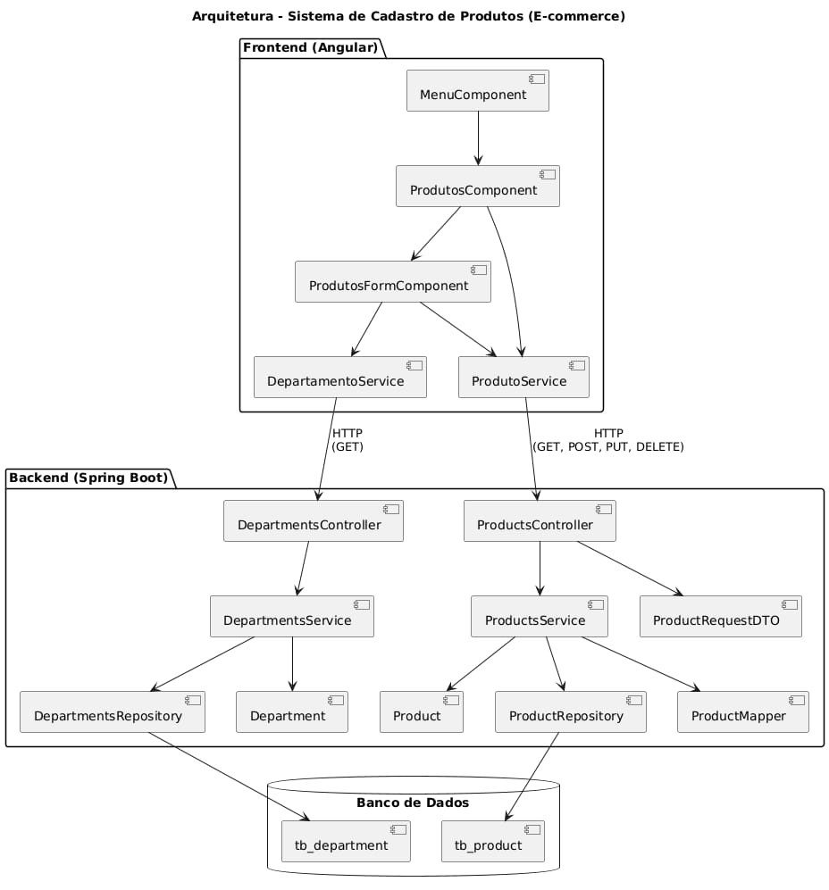

# 🛒 E-commerce API

API REST para gerenciamento de produtos e departamentos de um sistema e-commerce. Desenvolvido com Java e Spring Boot, adota boas práticas como DTOs, tratamento global de exceções e mapeamento com MapStruct.

## 🚀 Tecnologias

- Java 17
- Spring Boot
- Spring Data JPA
- H2 Database (para ambiente de desenvolvimento)
- MapStruct
- Maven
- Swagger
- Lombok

## 📁 Estrutura

\`\`\`
src/
├── controller/     # Endpoints REST (Produtos e Departamentos)
├── services/       # Camada de regras de negócio
├── repositorys/    # Interfaces JPA
├── models/         # Entidades e classes auxiliares
├── models/dto/     # DTOs usados nas requisições
├── mappers/        # Conversão entre entidades e DTOs
├── handlers/       # Tratamento global de exceções
├── configs/        # Configurações CORS
└── resources/sql/  # Scripts SQL (setup e inserts)
\`\`\`

## ⚙️ Como executar

\`\`\`bash
git clone https://github.com/seu-usuario/ecommerce-api.git
cd ecommerce-api
./mvnw spring-boot:run
\`\`\`

### Banco H2

- URL: \`http://localhost:8080/h2-console\`
- JDBC URL: \`jdbc:h2:mem:testdb\`
- Usuário: \`sa\` / Senha: *(vazio)*

### Scripts SQL

Utilize os scripts em \`src/main/resources/sql/setup.sql\` e \`inserts.sql\` para popular o banco.

## 🔗 Endpoints

### Produtos

- \`GET /api/products\`
- \`POST /api/products\`
- \`PUT /api/products/{id}\`
- \`DELETE /api/products/{id}\`

### Departamentos

- \`GET /api/departments\`

## 📘 Swagger

Documentação automática disponível em:

\`\`\`
http://localhost:8080/swagger-ui/index.html
\`\`\`

## Diagrama

